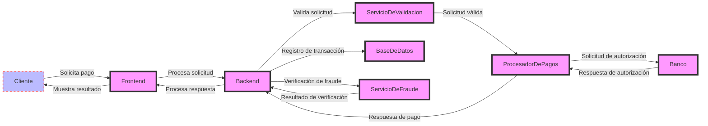
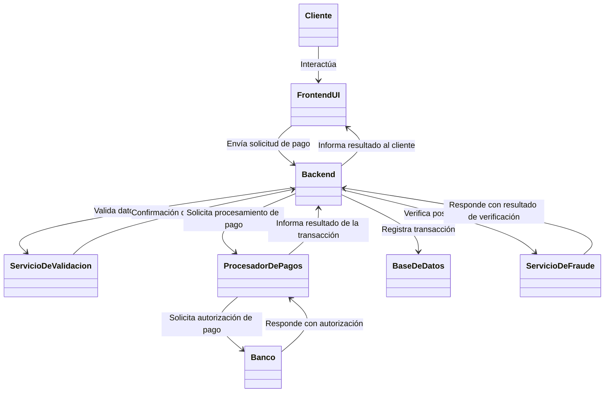
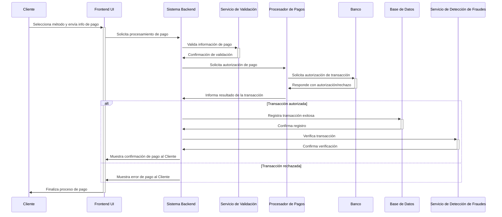
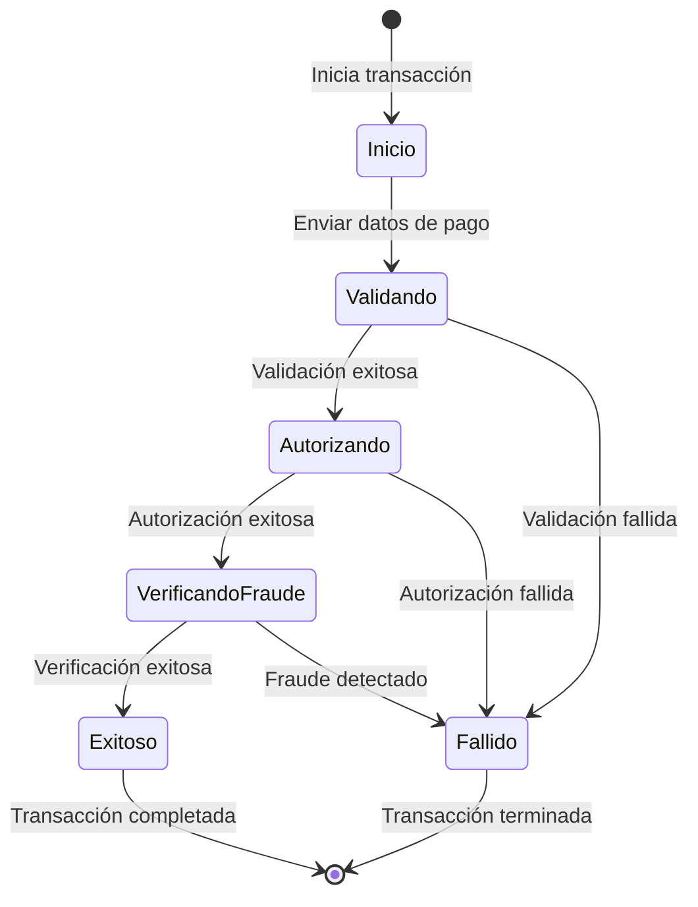

#### 1. Diagrama de secuencia


#### 2. Diagrama UML de Componentes


#### 3. Diagramas de secuencia UML



#### 4.Diagrama de Transición de Estados



#### estructura de carpetas

```
/payment-gateway-project
├── /backend
│   ├── /config             # Archivos de configuración y variables de entorno
│   ├── /controllers        # Clases controladoras para manejar solicitudes entrantes
│   ├── /middleware         # Middleware para el procesamiento de solicitudes
│   ├── /models             # Modelos de datos para la base de datos
│   ├── /routes             # Definiciones de rutas para la API
│   ├── /services           # Lógica de negocio y capa de servicios
│   ├── /utils              # Clases y funciones utilitarias
│   └── /validators         # Esquemas de validación de datos de solicitud
├── /frontend
│   ├── /public             # Archivos estáticos como HTML, CSS, imágenes y fuentes
│   ├── /src
│   │   ├── /components     # Componentes de UI reutilizables
│   │   ├── /pages          # Componentes de página
│   │   ├── /hooks          # Hooks personalizados de React
│   │   ├── /styles         # Estilos de la aplicación
│   │   └── /utils          # Funciones utilitarias para el frontend
│   └── /tests              # Archivos de prueba del frontend
├── /integration
│   ├── /bank               # Integración con APIs bancarias
│   ├── /payment-processor  # Integración con procesadores de pago externos
│   └── /fraud-detection    # Integración con servicios de detección de fraudes
├── /docs                   # Documentación del proyecto
├── /scripts                # Scripts utilitarios para despliegue, migraciones de base de datos, etc.
└── /tests
    ├── /backend            # Archivos de prueba del backend
    └── /integration        # Archivos de prueba de integración
```