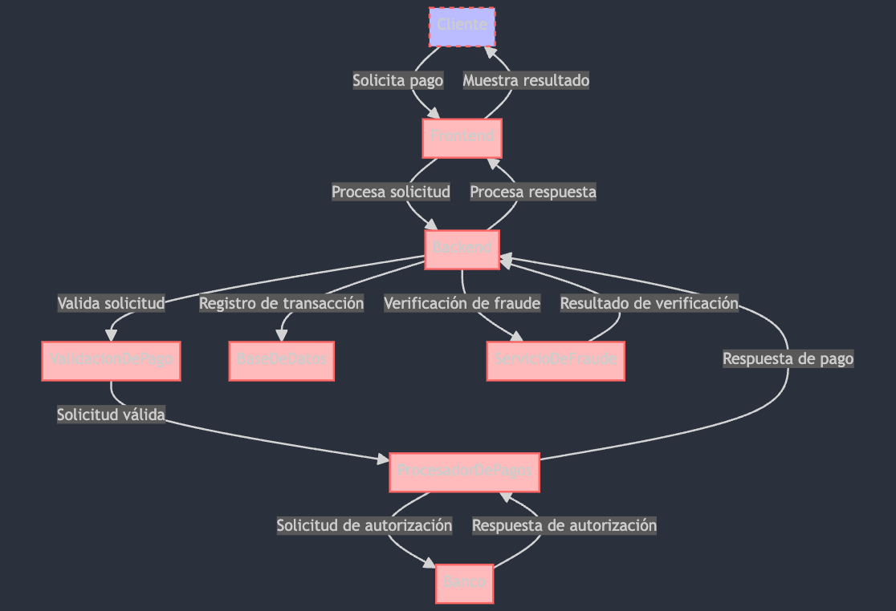

# Posible Solución
## Diagrama de Flujo
Para crear un diagrama de arquitectura de software para una pasarela de pago usando Mermaid, necesitamos definir los componentes principales del sistema y cómo interactúan entre sí. Una pasarela de pago típicamente interactúa con múltiples sistemas como el sitio web o aplicación del comerciante, el sistema bancario, y servicios de verificación de fraudes, entre otros. A continuación, te proporciono un ejemplo básico de cómo podría verse este diagrama.

```
graph TD;
    Cliente -->|Solicita pago| Frontend;
    Frontend -->|Procesa solicitud| Backend;
    Backend -->|Valida solicitud| ValidacionDePago;
    ValidacionDePago -->|Solicitud válida| ProcesadorDePagos;
    ProcesadorDePagos -->|Solicitud de autorización| Banco;
    Banco -->|Respuesta de autorización| ProcesadorDePagos;
    ProcesadorDePagos -->|Respuesta de pago| Backend;
    Backend -->|Procesa respuesta| Frontend;
    Frontend -->|Muestra resultado| Cliente;
    Backend -->|Registro de transacción| BaseDeDatos;
    Backend -->|Verificación de fraude| ServicioDeFraude;
    ServicioDeFraude -->|Resultado de verificación| Backend;

    classDef default fill:#f9f,stroke:#333,stroke-width:4px;
    classDef cliente fill:#bbf,stroke:#f66,stroke-width:2px,stroke-dasharray: 5, 5;
    classDef sistemas fill:#fbb,stroke:#f66,stroke-width:2px;
    
    class Cliente cliente;
    class Frontend,Backend,BaseDeDatos sistemas;
    class ValidacionDePago,ProcesadorDePagos,Banco,ServicioDeFraude sistemas;

```

Esto se vería de la siguiente manera:

## UML
Para generar un diagrama UML (Lenguaje Unificado de Modelado) para una pasarela de pago, crearemos un diagrama de componentes que muestra cómo se relacionan los distintos componentes del sistema entre sí. Este diagrama incluirá los componentes principales como el interfaz de usuario (UI), el sistema de backend, el procesador de pagos, el sistema de validación, el banco, la base de datos, y el servicio de detección de fraudes. Aquí tienes un ejemplo básico de cómo podría ser este diagrama UML:

```uml
@startuml

package "Frontend UI" {
    [Página de Pago]
}

package "Sistema Backend" {
    [Servidor de Aplicaciones]
    [Servicio de Validación de Pago]
    [Servicio de Registro de Transacciones]
}

package "Procesamiento de Pagos" {
    [Procesador de Pagos]
}

package "Banco" {
    [Sistema Bancario]
}

package "Servicios Externos" {
    [Servicio de Detección de Fraudes]
}

[Página de Pago] --> [Servidor de Aplicaciones] : Envía solicitud de pago
[Servidor de Aplicaciones] --> [Servicio de Validación de Pago] : Valida datos de pago
[Servicio de Validación de Pago] --> [Procesador de Pagos] : Solicitud de procesamiento de pago
[Procesador de Pagos] --> [Sistema Bancario] : Solicita autorización de pago
[Sistema Bancario] --> [Procesador de Pagos] : Responde con autorización
[Procesador de Pagos] --> [Servidor de Aplicaciones] : Notifica resultado del pago
[Servidor de Aplicaciones] --> [Servicio de Registro de Transacciones] : Registra el resultado del pago
[Servidor de Aplicaciones] --> [Servicio de Detección de Fraudes] : Verifica posible fraude
[Servicio de Detección de Fraudes] --> [Servidor de Aplicaciones] : Responde con resultado de verificación

@enduml


```
El resultado visual seria este:


## Diagrama de secuencia
Para ilustrar el flujo de interacciones en una pasarela de pago, crearemos un diagrama de secuencia UML. Este diagrama muestra cómo los diferentes actores y componentes del sistema interactúan entre sí a lo largo del tiempo para completar un pago. Vamos a detallar el flujo desde que un cliente inicia una solicitud de pago hasta que recibe una confirmación de pago, incluyendo los pasos de validación y procesamiento de la transacción.

``` 
sequenceDiagram
    participant Cliente
    participant UI as Frontend UI
    participant Backend as Sistema Backend
    participant Validacion as Servicio de Validación
    participant Procesador as Procesador de Pagos
    participant Banco
    participant BD as Base de Datos
    participant Fraude as Servicio de Detección de Fraudes

    Cliente->>+UI: Selecciona método y envía info de pago
    UI->>+Backend: Solicita procesamiento de pago
    Backend->>+Validacion: Valida información de pago
    Validacion->>-Backend: Confirmación de validación
    Backend->>+Procesador: Solicita autorización de pago
    Procesador->>+Banco: Solicita autorización de transacción
    Banco->>-Procesador: Responde con autorización/rechazo
    Procesador->>Backend: Informa resultado de la transacción
    alt Transacción autorizada
        Backend->>+BD: Registra transacción exitosa
        BD->>-Backend: Confirma registro
        Backend->>+Fraude: Verifica transacción
        Fraude->>-Backend: Confirma verificación
        Backend->>UI: Muestra confirmación de pago al Cliente
    else Transacción rechazada
        Backend->>UI: Muestra error de pago al Cliente
    end
    UI->>-Cliente: Finaliza proceso de pago

```
Se vería de esta manera:


## Diagrama de Estados

Para ilustrar el flujo de estados de una transacción en una pasarela de pago, crearemos un diagrama de transición de estados. Este tipo de diagrama muestra cómo una transacción pasa por diferentes estados desde el inicio hasta su conclusión, ya sea exitosa o fallida. Los estados comunes en una pasarela de pago incluyen "Inicio", "Validando", "Autorizando", "Verificando Fraude", "Exitoso", y "Fallido".

Aquí te muestro cómo sería un diagrama de transición de estados para una pasarela de pago utilizando la sintaxis de Mermaid:

``` 
stateDiagram-v2
    [*] --> Inicio: Inicia transacción
    Inicio --> Validando: Enviar datos de pago
    Validando --> Autorizando: Validación exitosa
    Validando --> Fallido: Validación fallida
    Autorizando --> VerificandoFraude: Autorización exitosa
    Autorizando --> Fallido: Autorización fallida
    VerificandoFraude --> Exitoso: Verificación exitosa
    VerificandoFraude --> Fallido: Fraude detectado
    Exitoso --> [*]: Transacción completada
    Fallido --> [*]: Transacción terminada
```
Y quedaría de la siguiente manera:


## Estructura del proyecto

Para un proyecto de pasarela de pago, organizar la estructura de carpetas de manera eficiente es crucial para mantener un código limpio y manejable, especialmente a medida que tu proyecto se escala. Aquí tienes una estructura de carpetas sugerida que sigue las mejores prácticas para un proyecto típico de aplicación web, que podría incluir servicios de backend, UI de frontend e integración con procesadores de pago externos:
```tree
/payment-gateway-project
├── /backend
│   ├── /config             # Configuration files and environment variables
│   ├── /controllers        # Controller classes for handling incoming requests
│   ├── /middleware         # Middleware for request processing
│   ├── /models             # Data models for your database
│   ├── /routes             # Route definitions for your API
│   ├── /services           # Business logic and service layer
│   ├── /utils              # Utility classes and functions
│   └── /validators         # Request data validation schemas
├── /frontend
│   ├── /public             # Static files like HTML, CSS, images, and fonts
│   ├── /src
│   │   ├── /components     # Reusable UI components
│   │   ├── /pages          # Page components
│   │   ├── /hooks          # Custom React hooks
│   │   ├── /styles         # Application-wide styles
│   │   └── /utils          # Utility functions for the frontend
│   └── /tests              # Frontend test files
├── /integration
│   ├── /bank               # Integration with bank APIs
│   ├── /payment-processor  # Integration with external payment processors
│   └── /fraud-detection    # Integration with fraud detection services
├── /docs                   # Documentation for the project
├── /scripts                # Utility scripts for deployment, database migrations, etc.
└── /tests
    ├── /backend            # Backend test files
    └── /integration        # Integration test files
```